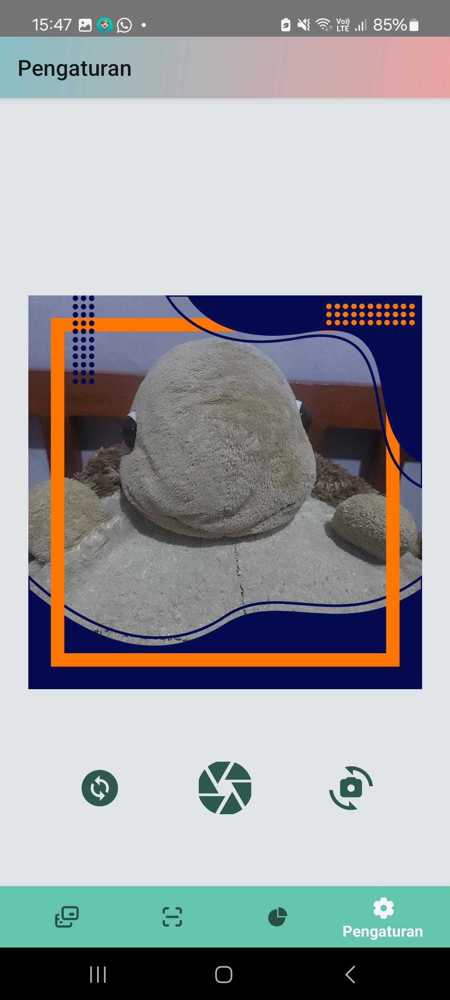

# IF3210-2024-Android-CMS

## Deskripsi Aplikasi

BondoMan adalah aplikasi berbasis Android untuk pencatatan transaksi berupa pemasukan dan pengeluaran. Data transaksi yang disimpan antara lain adalah judul, kategori, nominal, lokasi, dan waktu transaksi. Pengguna dapat menambah, mengubah, dan menghapus transaksi. Pengguna juga dapat melakukan scan dan upload bill transaksi. Selain itu, tersedia grafik yang menggambarkan proporsi pemasukan dan pengeluaran yang tercatat. Pengguna juga dapat menyimpan daftar transaksi dalam bentuk file excel serta mengirimkan laporan transaksi melalui surel. Terdapat juga fitur untuk merandomisasi transaksi. Terakhir, terdapat fitur tambahan yaitu foto menggunakan twibbon.  

Pengguna dapat menggunakan fitur-fitur aplikasi setelah melakukan login. Otentikasi hanya berlaku lima menit sejak pengguna melakukan login, sehingga pengguna akan logout secara otomatis dan harus melakukan login kembali. 

## Library yang Digunakan

1. Kotlin standard library
2. AndroidX libraries for UI components, lifecycle management, navigation, work manager, fragment, room database, activity, and view model.
3. Compose libraries for UI development
4. Retrofit for API communication
5. OkHttp for HTTP client
6. Google Play Services for location and maps
7. Coroutines for asynchronous programming
8. Apache POI for handling Excel files
9. MPAndroidChart for plotting graphs
10. Core libraries for various Android functionalities such as animations, performance analysis, broadcast receivers, role management, shortcuts, remote views, and splash screen.

## Screenshot Aplikasi
 
 
 
 
 
 
 
 
 
 
 
 
 
 
 
 
 
 

## Pembagian Tugas
| Nama | NIM | Tugas |
|-----------------|-----------------|-----------------|
| Husnia Munzayana | 13521077 |CRUD transaksi, Lihat daftar transaksi, Simpan daftar transaksi, broadcast receiver, halaman tentang transaksi, intent gmail |
| Tabitha Permalla | 13521111 | ui/ux, Header Navbar, Login, Logout, Graf rangkuman, Background JWT Expiry, halaman splash, login, graph |
| Althaaf Khasyi Atisomya | 13521130 | Scan nota, Deteksi sinyal, init, db, halaman setting, scan, twibbon |

## Jumlah Jam Persiapan dan Pengerjaan

| Nama | NIM | Jumlah Jam Persiapan | Jumlah Jam Pengerjaan |
|-----------------|-----------------|-----------------|-----------------|
| Husnia Munzayana | 13521077 | 10 | 30 |
| Tabitha Permalla | 13521111 | 10 | 30 |
| Althaaf Khasyi Atisomya | 13521130 | 10 | 30 |
